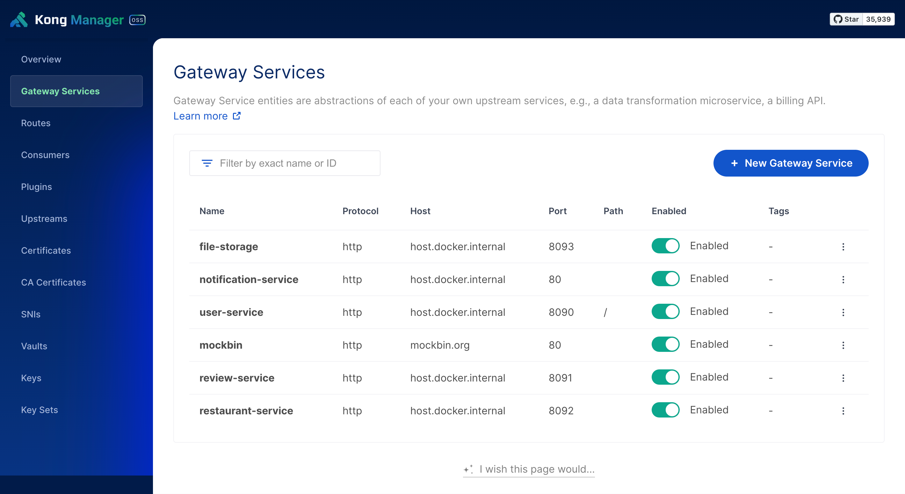

<p align="center">
  
</p>

# KU Wongnai - API Gateway

The gateway that connected to the microservices.

## Pre-requisite

Install decK CLI

### MacOS

If you are on macOS, install decK using brew:

```sh
brew tap kong/deck
brew install deck
```

### Windows

if you are on Windows, you can either use the compressed archive from the Github [release page](https://github.com/kong/deck/releases) or install using CMD by entering the target installation folder and downloading a compressed archive, which contains the binary:

```sh
curl -sL https://github.com/kong/deck/releases/download/v1.25.0/deck_1.25.0_windows_amd64.tar.gz -o deck.tar.gz
mkdir deck
tar -xf deck.tar.gz -C deck
powershell -command "[Environment]::SetEnvironmentVariable('Path', [Environment]::GetEnvironmentVariable('Path', 'User') + [IO.Path]::PathSeparator + [System.IO.Directory]::GetCurrentDirectory() + '\deck', 'User')"
```

> **Note**
> Please refer to [the docs](https://docs.konghq.com/deck/latest/installation/) for more informations.

## Usage

Start Kong

```sh
docker-compose --profile database up -d
```

Sync Kong configuration to Kong Manager GUI

```sh
deck sync
```

After done with editing or adding services and routes via Kong Manager GUI, run the following command to export the configuration to `kong.yaml` file.

```sh
deck dump
```

Open http://localhost:8002 and you should see something like this.



## Routes

| Route                 | Description      |
| --------------------- | ---------------- |
| http://localhost:8000 | Kong Client API  |
| http://localhost:8001 | Kong Admin API   |
| http://localhost:8002 | Kong Manager GUI |

## Calling the API

`<service-name>` is the name of the service that you want to call. e.g. `user`, `restaurant`, `review`, `noti`, `file`

`<route-path>` is the path of the route that you want to call. Same as the path that you defined in the service.

```
http://localhost:8000/<service-name>/<route-path>
```

## TODOs

- [x] Add more services and routes
- [x] Write a documentation
- [ ] Include more routes when other services are ready

## Reference

- https://docs.konghq.com/gateway/3.4.x/get-started/services-and-routes/
- https://github.com/Kong/docker-kong/tree/master/compose
